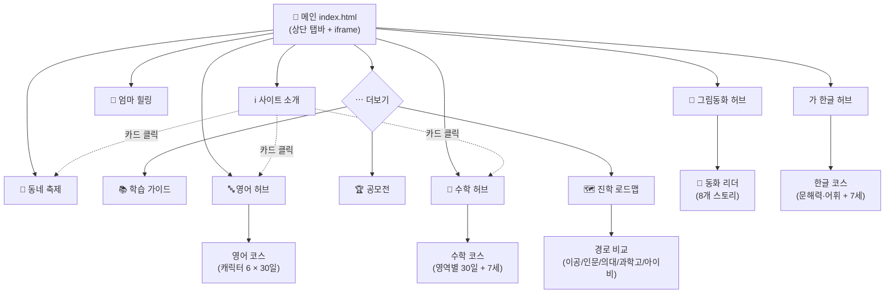
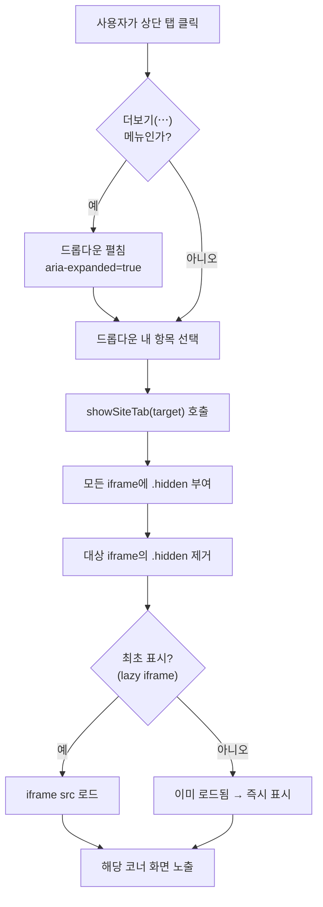
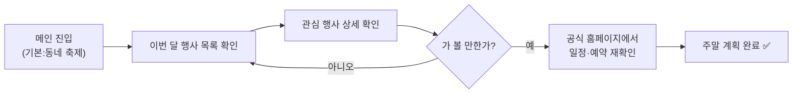
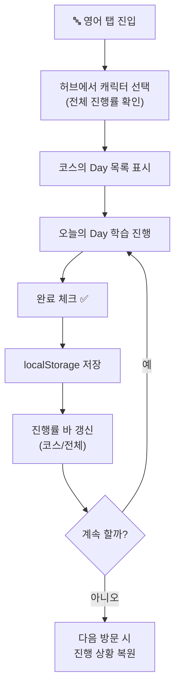
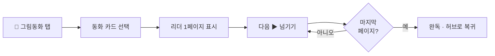
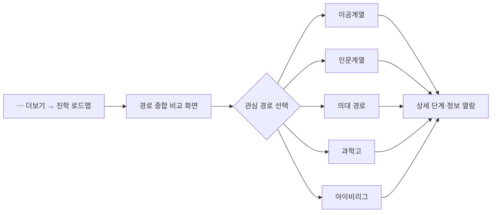
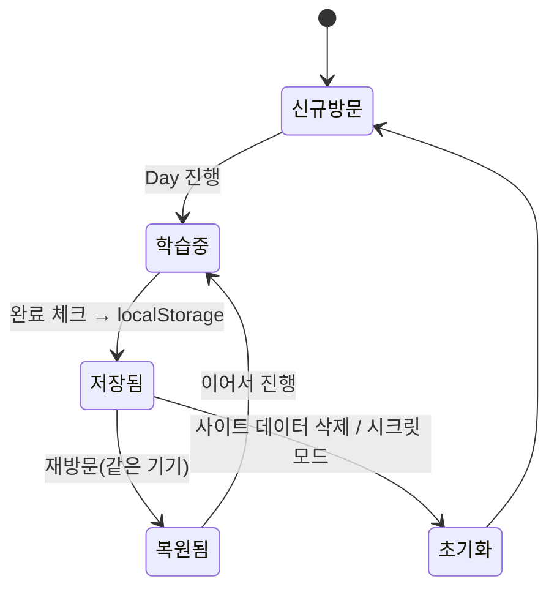

# UX 흐름도 — 우리 동네 꼬마 놀이터

| 항목 | 내용 |
|------|------|
| 문서명 | UX 흐름도 (User Flow) |
| 버전 | v1.0 |
| 작성일 | 2026-06-04 |

> 다이어그램은 [Mermaid](https://mermaid.js.org) 문법으로 작성되어 GitHub·VS Code(Markdown Preview Mermaid)에서 렌더링된다.

---

## 1. 전체 내비게이션 구조 (Site Map)

---

## 2. 탭 전환 흐름 (핵심 인터랙션)

메인은 페이지 새로고침 없이 **iframe 표시/숨김**으로 코너를 전환한다.

---

## 3. 주요 시나리오별 흐름

### 3.1 [부모] 주말 나들이 찾기 — 김서연

### 3.2 [부모+아이] 영어 학습 진행 — 이하준

### 3.3 [아이] 그림동화 읽기

### 3.4 [부모] 진학 로드맵 비교 — 박지훈

---

## 4. 진행 상황 저장 상태 흐름

---

## 5. 인터랙션 원칙 (페르소나 반영)

| 원칙 | 적용 |
|------|------|
| **3-클릭 이내 도달** | 메인 → 코너 → 콘텐츠. 자주 쓰는 메뉴는 탭, 나머지는 더보기로 분리 |
| **새로고침 없는 전환** | iframe show/hide로 컨텍스트 유지, 빠른 체감 속도 |
| **즉각 피드백** | 완료 체크 시 진행률 바 즉시 반영 (아이 성취감) |
| **이어하기** | localStorage로 진행 상황 자동 복원 (재방문 동기) |
| **안전한 폴백** | 자식 페이지 단독 진입 시 메인으로 유도 |
| **큰 터치 타깃** | 아이가 부모 기기로 직접 조작 가능하도록 |
